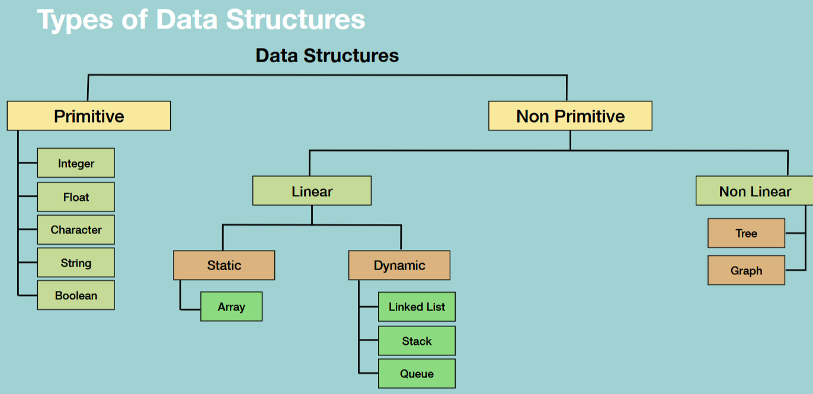

<h1 style="text-align: center;">Introdução </h1>


## O que é Estrutura de Dados ?

> Estruturas de Dados são diferentes formas de organizar dados no seu computador, que podem ser usadas de forma eficiente

## O que é um Algoritmo?
> Um conjunto de instruções para se realizar uma tarefa

- Resolve o problema corretamente?
- É eficiente? 

  


- Algoritmo $\Omicron(\log N)$  

```python
i = 1
sum = 0

while i < n:
    sum += i 
    i *= 2

# The loop iterates 'log n' times, as 'i' is multiplied by 2 in each iteration. The time complexity is O(log n).
```
