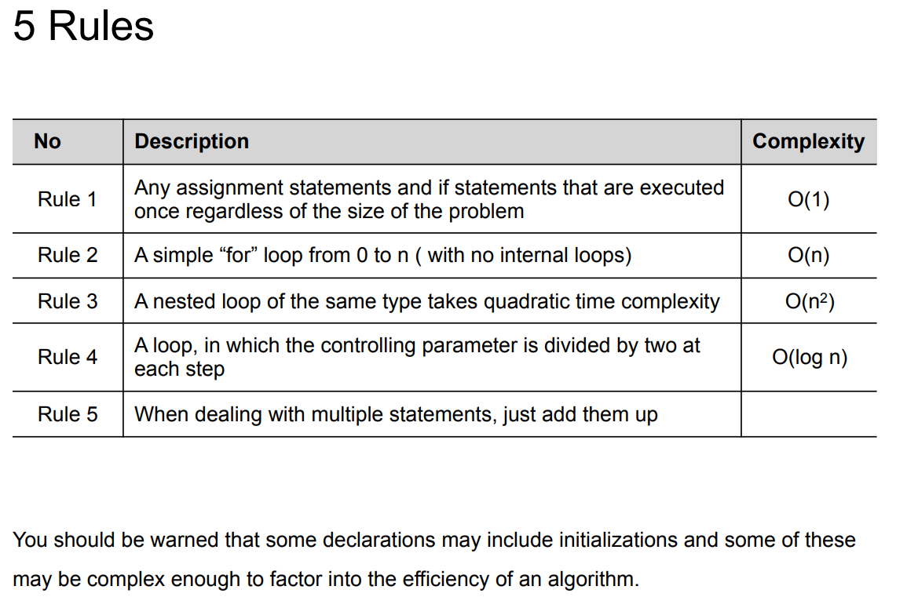

# Big O Notation $\mathcal{O}$


__Time Complexity__:  Uma forma de mostrar quanto que o _runtime_ de uma função aumenta a medida que se aumenta o tamanho do input. Mede o número de operações

__Space Complexity__: Quantidade de memória utilizada por um código 

## Notações
Suponha que queiramos achar um número:
```python
numbers: list = [1, 2, 4, 5, 6, 7, 8]
```
- Achar 1 : Best case $\Omega$  
- Achar 4 : Medium case $\Theta$  
- Achar 8 : Worst case $\Omicron$  

> Quando estamos medindo o _Big O_ estamos sempre medindo $\color{red} \text{O pior caso!}$

## Complexidade de tempo de execução
__Operações__ x __Elementos__  

- Constante $\Omicron(1)$
- Linear $\Omicron(N)$
- Quadrática $\Omicron(N^2)$
- Logarítmica $\Omicron(\log N)$

💡$\Omicron(N)$ , $\Omicron(2N)$, $\Omicron(100N)$ $\rightarrow \Omicron(N)$  
💡$\Omicron(N^3), \Omicron(N^4), \Omicron(N^{10}) \rightarrow \Omicron(N^2)$  
💡 $\Omicron(N^2 + N) = \Omicron(N)$

## Como medir na notação Big $\Omicron()$
